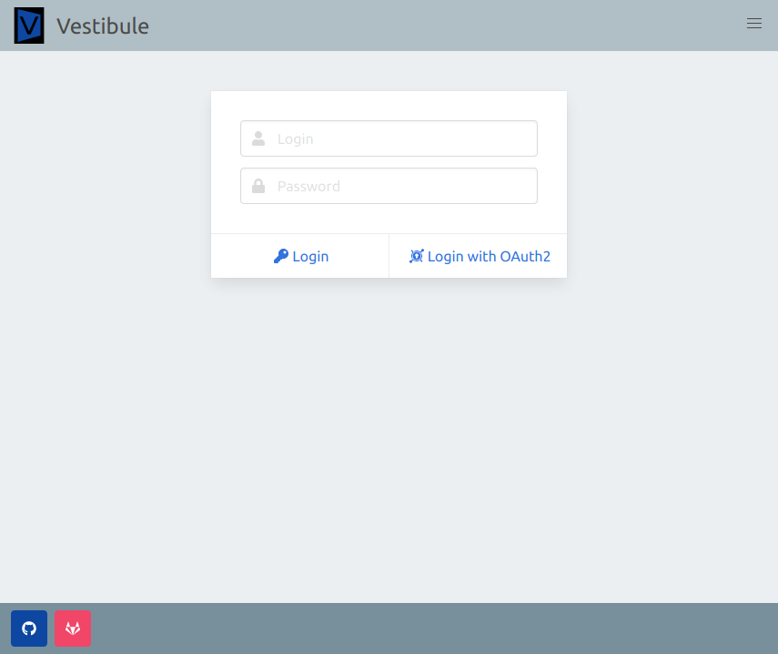
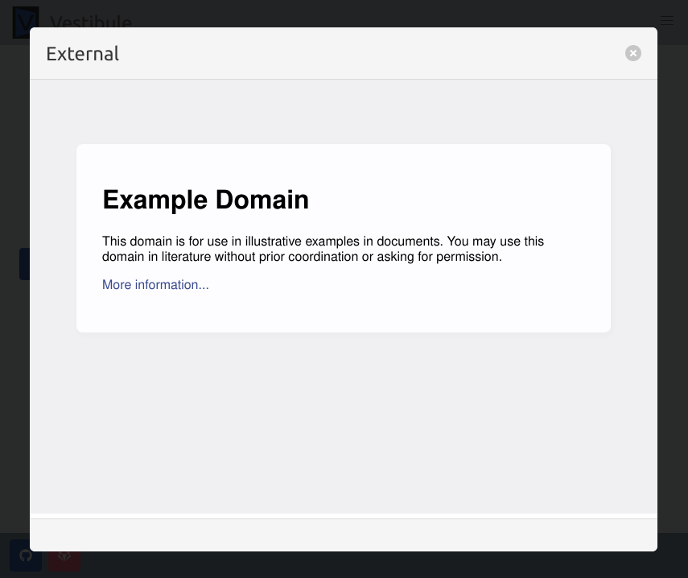
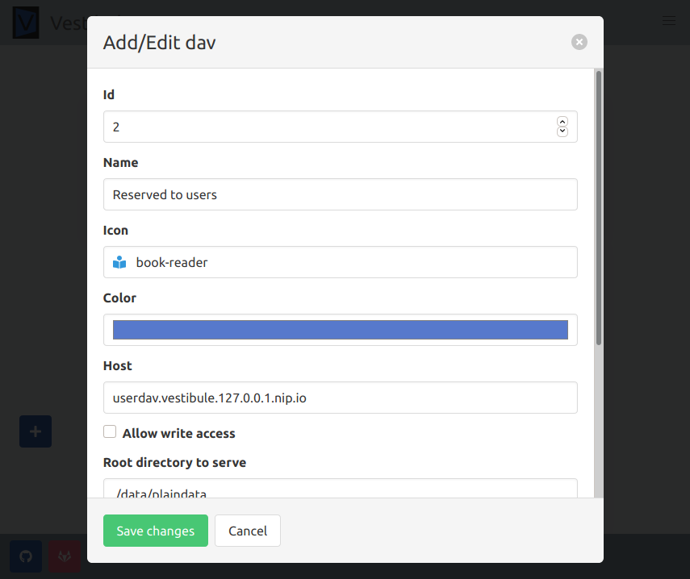
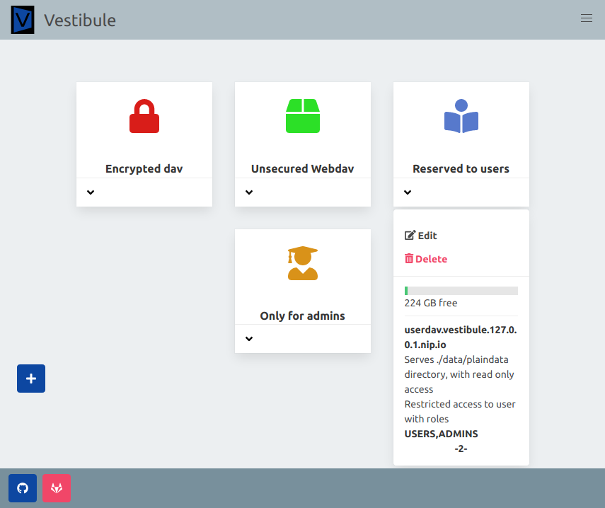
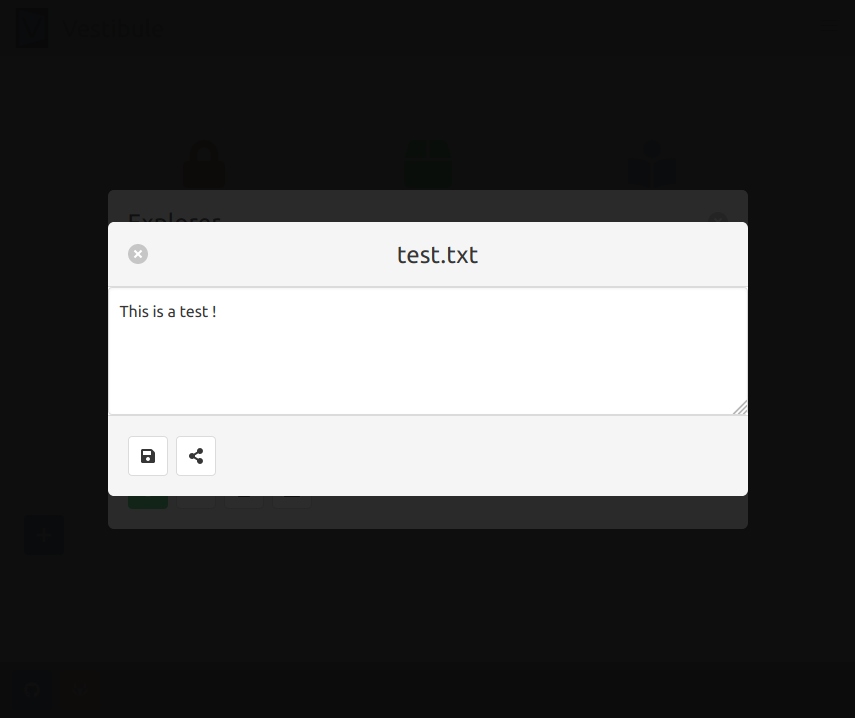
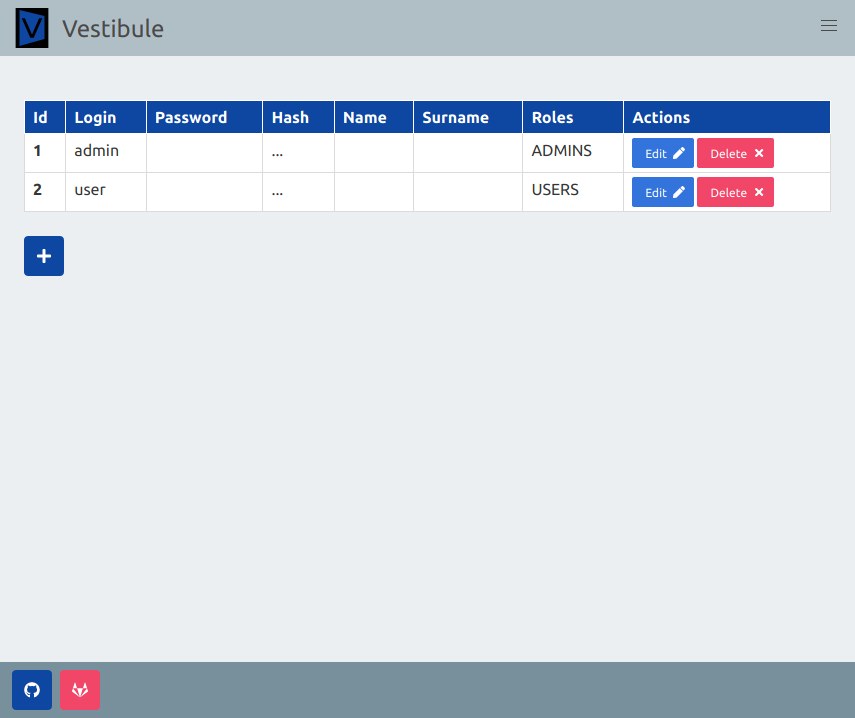

# Vestibule

Alternate URL (on the Grand Lyon software forge) : https://forge.grandlyon.com/NPERNOUD/vestibule .

Vestibule is an HTTP server, reverse proxy and webdav server, with OIDC/OAuth2 and local users file authentication, and a _Single Page Application_ GUI to configure everything.

[](https://sonarcloud.io/dashboard?id=nicolaspernoud_Vestibule)
[](https://sonarcloud.io/dashboard?id=nicolaspernoud_Vestibule)
[](https://sonarcloud.io/dashboard?id=nicolaspernoud_Vestibule)
[](https://sonarcloud.io/dashboard?id=nicolaspernoud_Vestibule)
[](https://sonarcloud.io/dashboard?id=nicolaspernoud_Vestibule)
[](https://sonarcloud.io/dashboard?id=nicolaspernoud_Vestibule)
[](https://sonarcloud.io/dashboard?id=nicolaspernoud_Vestibule)
[](https://sonarcloud.io/dashboard?id=nicolaspernoud_Vestibule)
[](https://sonarcloud.io/dashboard?id=nicolaspernoud_Vestibule)
[](https://sonarcloud.io/dashboard?id=nicolaspernoud_Vestibule)

## Features

- Reverse proxy any website (internal or external), with GUI configuration
- Authenticate users against OIDC/OAuth2 server and fetch user roles based on /userinfo endpoint
- Expose any file system directory as webdav server with web explorer
- Allow opening and saving of documents with onlyoffice integration
- Automatic let's encrypt https

### Screenshots











### How does it works ?

Vestibules authenticates the users against a local user.json file or an OIDC/OAuth2 provider (with Open Id Connect userinfo endpoint). It issues an encrypted cookie for the global domain (say vestibule.io) containing the user roles gotten from the local user database or the "memberOf" claim of the OIDC/OAuth2 user gotten from the userinfo endpoint.

After, for every access to a proxied application or a webdav service (say myapp.vestibule.io), it checks the cookie to allow users based on their roles.

Applications and davs can be opened to everyone as well (no authentication).

Vestibule creates a subdomain for every services (apps and davs) and provide Let's encrypt certificates automatically.

## Installation

### Locally

Clone the repository.
Alter the `.env` file with your configuration.
Launch `start.sh`.

### With docker

Alter `.env` and `docker-compose.yml` according to your needs.
Launch with `COMPOSE_DOCKER_CLI_BUILD=1 DOCKER_BUILDKIT=1 docker-compose up`.
A production deployment example is also provided in the production-deployment-example.sh file.
The mock ip geodatabase should be replaced with a real one from maxmind for real usefullness.

## Usage

### OIDC/OAuth2 configuration

The OIDC/OAuth2 provider is configured with environment variables. The user is recovered with the /userinfo endpoint (part of the Open Id Connect standard) with a standard OAuth2 dance.
Vestibule is compatible with most OpenIdConnect providers (including Keycloak), or OAuth2 providers with the /userinfo endpoint.

The users roles **must** be recovered in an "memberOf" claim array obtained when accessing the /userinfo endpoint. It can be configured to map any group/role configuration on most IdPs.

### Mounting webdav share on your OS

Vestibule allow using the authentication token in an basic auth header to allow mounting webdavs.
Here is an example of a script login in the user and using the token from the cookie to mount webdav on Ubuntu Linux :

```bash
#/bin/bash
LOGIN_URL=https://vestibule.127.0.0.1.nip.io:1443/Login
DAV_URL=davs://userdav.vestibule.127.0.0.1.nip.io:1443
LOGIN=admin
PASSWORD=password
SENT_BODY="{\"login\":\"${LOGIN}\",\"password\":\"${PASSWORD}\"}"
HTTP_RESPONSE=$(curl -k --header "Content-Type: application/json" --request POST --data ${SENT_BODY} --silent --output /dev/null --cookie-jar - $LOGIN_URL)
TOKEN=$(echo $HTTP_RESPONSE | awk '{ print $NF }')
printf "1\n${LOGIN}\n${TOKEN}\n" | gio mount $DAV_URL
```

### Override branding

Every branding asset is in `web/assets/brand` directory. They can be altered according to your needs.

## Development

### Update dependencies

```bash
go get -u
go mod tidy
```

### Register both remotes

```bash
git remote add forge https://forge.grandlyon.com/NPERNOUD/vestibule.git
git remote set-url --add --push origin https://forge.grandlyon.com/NPERNOUD/vestibule.git
git remote set-url --add --push origin https://github.com/nicolaspernoud/Vestibule.git
```

### Get all branches

```bash
git fetch --all
```

## Credits

Loosely based on Webfront (https://github.com/nf/webfront), by Andrew Gerrand, Google (Apache License, Version 2.0).

Uses :

- Bulma : https://bulma.io/, https://github.com/jgthms/bulma (MIT Licence)
- Animate.css : https://daneden.github.io/animate.css/, https://github.com/daneden/animate.css (MIT Licence)
- Font Awesome : https://fontawesome.com, https://github.com/FortAwesome/Font-Awesome (Font Awesome Free License)
- Secure IO : https://secure-io.org, https://github.com/secure-io/sio-go (MIT Licence), lots of thanks to @aead (Andreas Auernhammer) who has been a great help in understanding the library and for his cryptography insights
- MaxMind DB Reader for Go : https://github.com/oschwald/maxminddb-golang (ISC License)
- HTTP Cache by Victor Springer : https://github.com/victorspringer/http-cache (MIT Licence), parts are included in pkg/cache directory (to avoid getting unwanted redis dependencies)
- Go-Glob by Ryan Uber : https://github.com/ryanuber/go-glob (MIT Licence)
- go-disk-usage by ricochet2200 : https://github.com/ricochet2200/go-disk-usage (The Unlicense)

## Licence

The product is licenced under **_GNU AFFERO GENERAL PUBLIC LICENSE Version 3_**, it is made primarily by Nicolas Pernoud, a member of **Métropole de Lyon**, on professional time (some), and personal time (most). It is used on Métropole de Lyon "alpha" lab to allow quick prototyping and proof of concepts.


## Beeing part of the project

Contributions of any kind welcome!
